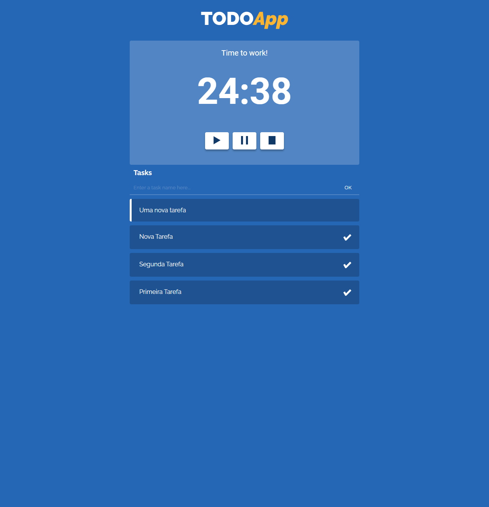

# TODO App - Frontend

This is a simple project to practice React with TypeScript.

## Preview



## Requirements

To run this project you need to have the backend working. See [here](https://github.com/diogosaucedo/todo-app-backend) how to prepare it.

## Available Scripts

In the project directory, you can run:

### Installation

```node
npm install
```

### Running

```node
npm start
```

### Test

```node
npm test
```

### Build

```node
npm run build
```
